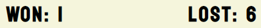
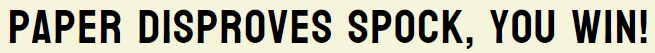
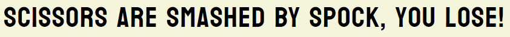
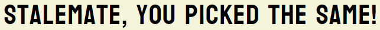
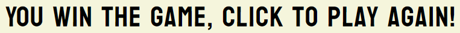
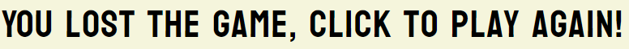
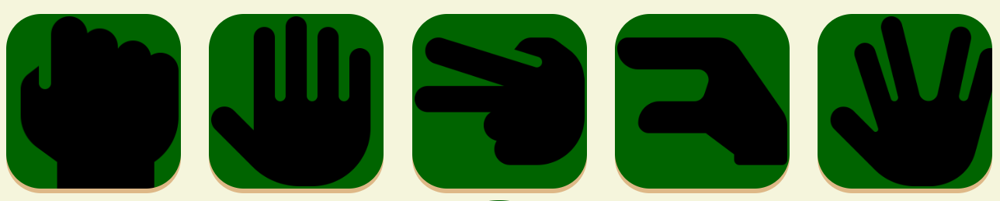
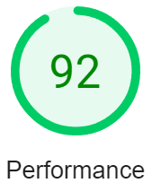
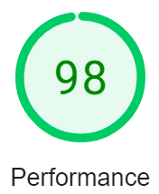

# Rock, Paper, Scissors, Lizard, Spock

## About

Rock, Paper, Scissors, Lizard, Spock is a twist to on the commonly played game Rock, Paper, Scissors game.
It comes from the tv show The Big Bang theory and gives a new take on the game with a larger selection to choose from.

## Usage

Rock, Paper, Scissors, Lizard, Spock is for people who want to play a bigger version of Rock, Paper, Scissors, Lizard, Spock and for people who enjoy The Big Bang Theory and want to play their take of Rock, Paper, Scissors.

The game was built for mobile usage firstly as most people use their phones to play games like this rather than a computer/laptop.

## Design

I went for a design that the colours contrasts quite well and is easy on the eyes to look at.
I thought a simple design was perfect for a simple game.

// insert amiresponsiveimage

## Features

 - __Title__

   - The title of the game is an image instead of text

 - __Score Board__

   - A score board that shows how many rounds the player has won and lost.
   - The score resets to 0 when the score hits 10 and declares the winner.

 - __Game Result__

   - This display the round result, if the player wins, loses or draws the round.
   - Declare if the player wins or loses the game when either the player or computer achieves 10 wins.

 - __Player Choice__

   - The player has 5 choices to pick from, from left to right; Rock, Paper, Scissors, Lizard and Spock.
   - When picked it will then be matched against a random computer choice.
  

## Testing

### Validator Testing

  - __HTML__

  - No errors were found when checking on [w3c validator](http://jigsaw.w3.org/css-validator/validator?lang=en&profile=css3svg&uri=https%3A%2F%2Fjoshuaandrews-1882.github.io%2Fproject-2%2F&usermedium=all&vextwarning=&warning=1).
- __CSS__

  - No errors were found when checking on [(Jigsaw) validator](http://jigsaw.w3.org/css-validator/validator?lang=en&profile=css3svg&uri=https%3A%2F%2Fjoshuaandrews-1882.github.io%2Fproject-2%2F&usermedium=all&vextwarning=&warning=1).

  ### Page Speed

#### Tested Mobile and Desktop Speed on [PageSpeed Insights](https://developers.google.com/speed/pagespeed/insights/)

- __Mobile__

  - Speed is good

- __Desktop__

  - Speed is very good

### Personal Check

  - Used a PC, tablet and a mobile to check the game and everything is good.

### Unfixed Bugs

  - No known bugs

## Deployment

- __The website was deployed on GitHub pages, it is done as followed:__

  - In the repository for the website to be published, click on settings of you repositories.
  - Click on the pages tab in the left hand section.
  - In Source change the branch to main, ensure root is selected next to it and then click save.
  - A link will appear for your website, wait a few minutes and refresh, it should be ready.
  - If it says ready but still not loading then wait a little longer, it will eventually load.
  - Ensure images are relative path and not absolute otherwise they will not load.

The link for this site is - https://joshuaandrews-1882.github.io/project-2/ 

## Credits

### Content

  - A guide on how to make the JS grab the button IDs when pressed was taken from [Ania Kubów on YouTube](https://www.youtube.com/watch?v=RwFeg0cEZvQ&t=450s).
  - Instructions for a image popup modal was taken from [w3schools](https://www.w3schools.com/howto/howto_css_modal_images.asp).
  - For fonts I used [Google Fonts](https://fonts.google.com/).

  ### Media

  - The game button images were taken from [Font Awesome](https://fontawesome.com/).
  - For the title and rules image I used [Canva](https://www.canva.com/).
